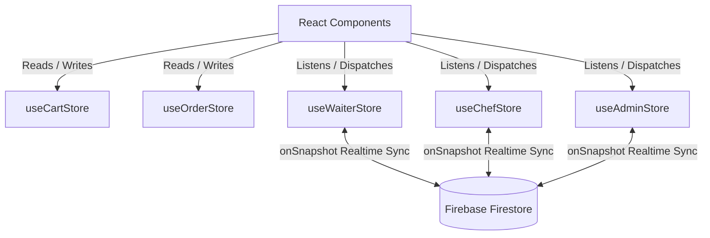

# SmartServe Database Schema & State Management

This document details the database architecture (Firebase Firestore) and local state store architecture (Zustand) utilized by **SmartServe**.

---

## 1. Firebase Firestore Schema

SmartServe uses Firestore for real-time document synchronization. The database consists of 7 primary collections.

### 1.1 `menuItems` (Collection)
Contains the catalog of dishes available for order.
*   **Document ID**: Autoincrement string (`"1"`, `"2"`, `"3"`, etc.)
*   **Schema**:
    ```typescript
    interface MenuItem {
      id: string;
      name: string;
      price: number;
      image: string;
      category: string;
      type: 'veg' | 'non-veg';
      available: boolean;
      prepTime: number; // in minutes
      slot?: 'morning' | 'evening' | 'night' | 'all';
    }
    ```

### 1.2 `waiters` (Collection)
Contains service staff directory, statuses, and performance statistics.
*   **Document ID**: Formatted ID (`"W-01"`, `"W-02"`, etc.)
*   **Schema**:
    ```typescript
    interface Waiter {
      id: string;
      name: string;
      email: string;
      avatar: string;
      onlineStatus: boolean;
      rating: number;
      totalDeliveries: number;
      todayTips: number;
      pin?: string; // PIN for waiter terminal authentication
      status?: 'Active' | 'On Break' | 'Offline';
    }
    ```

### 1.3 `chefs` (Collection)
Contains kitchen staff directory, current workloads, and shift statuses.
*   **Document ID**: Formatted ID (`"C1"`, `"C2"`, etc.)
*   **Schema**:
    ```typescript
    interface Chef {
      id: string;
      name: string;
      avatar: string;
      rating: number;
      ordersPrepared: number;
      activeLoad: number; // calculated active orders assigned (New + Preparing)
      pin?: string; // PIN for chef console authentication
      section?: string; // e.g. "Sauté Station", "Prep Line"
      shiftWindow?: string;
      breakRemainingSecs?: number;
      breakUntil?: number | null; // Milliseconds timestamp when chef's break ends
    }
    ```

### 1.4 `orders` (Collection)
Tracks all customer orders through the kitchen preparation pipeline.
*   **Document ID**: Custom ID (`"O101"`, `"O102"`, etc.)
*   **Schema**:
    ```typescript
    interface ChefOrder {
      id: string;
      tableNumber: number;
      items: { name: string; quantity: number }[];
      prepTimeMins: number;
      status: 'New' | 'Preparing' | 'Ready' | 'Picked Up' | 'Completed' | 'Delivered' | 'Cancelled';
      assignedChefId: string; // routed via the smart load balancing algorithm
      timeReceived: string; // HH:MM AM/PM string
      createdAt?: number; // Milliseconds timestamp
      startedPreparingAt?: number | null;
      completedAt?: number | null; // Milliseconds timestamp when chef will finish preparation
      price?: number;
      paymentMethod?: string; // "later", "cash", "upi", "card"
      paymentStatus?: 'Unpaid' | 'Paid';
    }
    ```

### 1.5 `tables` (Collection)
Maintains dining room physical tables status in real-time.
*   **Document ID**: Formatted ID (`"T1"`, `"T2"`, etc.)
*   **Schema**:
    ```typescript
    interface ActiveTable {
      id: string;
      number: number;
      capacity: number;
      status: 'occupied' | 'ordering' | 'waiting' | 'billing' | 'idle';
      assignedWaiterId?: string; // waiter assigned to serve this table
    }
    ```

### 1.6 `notifications` (Collection)
Tracks service alarms (chimes) triggered from tables or the kitchen to waiters.
*   **Document ID**: Unique key (`"N_1718101000_abcde"`)
*   **Schema**:
    ```typescript
    interface WaiterNotification {
      id: string;
      type: 'table_ready' | 'call_waiter' | 'billing_request';
      message: string;
      time: string; // HH:MM AM/PM
      read: boolean;
    }
    ```

### 1.7 `reviews` (Collection)
Stores dining feedbacks and ratings left by guests.
*   **Document ID**: Random UUID or hash
*   **Schema**:
    ```typescript
    interface GuestReview {
      id: string;
      customerName: string;
      avatar: string;
      rating: number;
      comment: string;
      date: string; // YYYY-MM-DD
      dishName: string;
    }
    ```

---

## 2. Zustand State Architecture

SmartServe decouples UI components from API logic using 4 localized Zustand stores.



### 2.1 Customer Stores
*   **`useCartStore`**: Handles local selection of menu items, item quantity modifications, diet preference filters, table assignments, and tip/discount application logic. Syncs values to LocalStorage.
*   **`useOrderStore`**: Handles active order tracking phases (`Confirmed` -> `Preparing` -> `On The Way` -> `Delivered`). Controls the tracking clock state and saves the running active order ID inside LocalStorage to persist sessions.

### 2.2 Staff Stores
*   **`useWaiterStore`**: Listens to waiters list, orders collection, physical tables state, and notifications collection via real-time Firestore listeners. Manages PIN authorization and playChime audio sound notifications.
*   **`useChefStore`**: Houses the **Smart Routing Load Balancer** logic. It calculates chefs' active queues (current queue duration, buffer allocations, break intervals) to auto-assign incoming orders. Starts/stops background ticker checking tasks.
*   **`useAdminStore`**: Central controller managing menu listings (CRUD operations directly to Firestore), staff management, reviews directory sync, and global tax rate configs.
